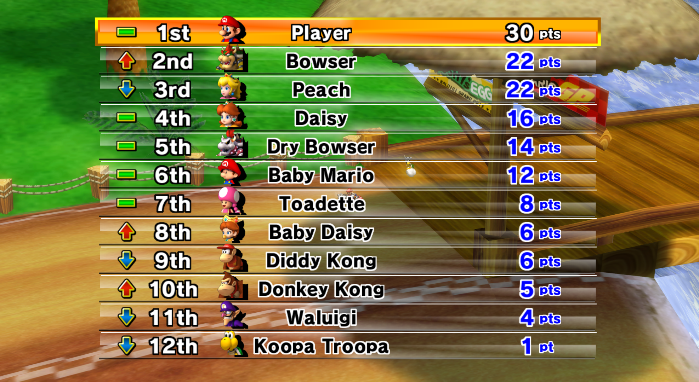

## Show Everyone's Placement Difference From the Previous Race

This is a gecko code that displays, from the second race on, each players' placement difference from the last race as a graphic.



Mario Kart Wii is the only modern Mario Kart game (Mario Kart Double Dash!! and onwards) to not display each racers' placement difference from the last race. This code reimplements the feature with custom graphics that are faithful to the game's UI design.

Beyond needing Pyiiasmh or Codewrite to assemble the code itself, several files need to be modified in order for this mod to function.

```
Race.szs/Race_R.szs
Font.szs/Font_K.szs
Race_U.szs
Race_F.szs
Race_M.szs
Race_E.szs
Race_F.szs
Race_S.szs
Race_G.szs
Race_I.szs
Race_J.szs
Race_K.szs
```

### Modification
To make further modifications to this project, the following internal files and locations have either been added or modified. These modified files can be found in the "data" folder.

```
position_12players.brlyt (Modified) (Inside "Race.szs")
tt_kart_extension_font.brfnt (Modified) (Inside "Font.szs")
Race.bmg (Modified) (Inside all region specific Race files from above.)

Unicode:
- F07D = Placement None
- F07E = Placement Improve
- F07F = Placement Regress

BMG IDs:
- 0x5e2 = Placement None
- 0x5e3 = Placement Improve
- 0x5e4 = Placement Regress
```

See "BUILDING.md" for information about how to build the custom assets.

### Credits
* MelgMKW and Brawlboxgaming - [Pulsar](https://www.github.com/MelgMKW/Pulsar), used as a reference with some function names and symbols as well as the code [Show Everyone's Time After a Race](https://mariokartwii.com/showthread.php?tid=1609) which was used as a starting point for research.
* Ghidra Project - Function names and symbols.
* QuestionBlock22 - Custom graphics and programming.
